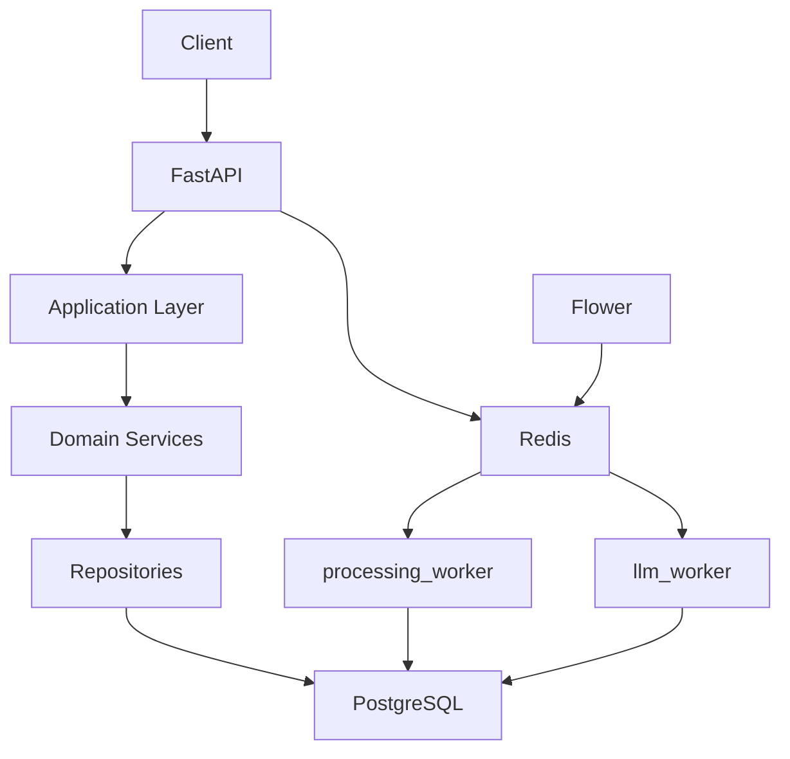
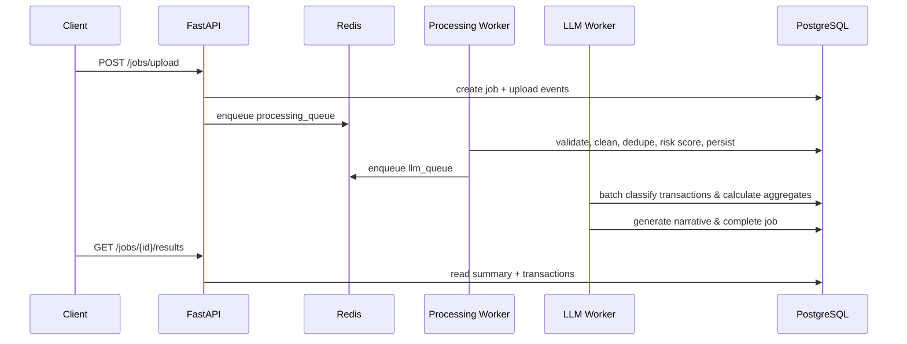
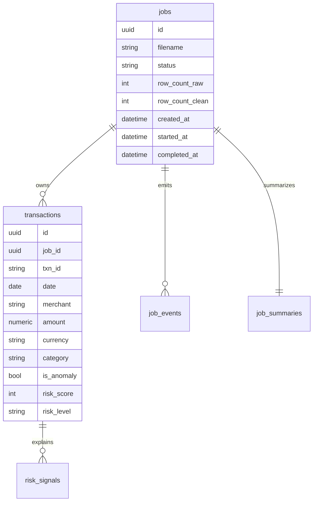

# AI Transaction Processing Pipeline

Production-grade modular monolith for processing large transaction CSV files with deterministic cleaning, risk detection, batched LLM classification, report generation, and operational observability.

## Run

```bash
docker compose up --build
```

Services:

- API: http://localhost:8000
- OpenAPI: http://localhost:8000/docs
- Flower: http://localhost:5555
- Postgres: localhost:5432
- Redis: localhost:6379

Migrations run automatically on container startup.

## API

- `POST /jobs/upload`
- `GET /jobs?status=COMPLETED&limit=50&offset=0`
- `GET /jobs/{id}`
- `GET /jobs/{id}/status`
- `GET /jobs/{id}/results?limit=100&offset=0`
- `GET /jobs/{id}/timeline`
- `GET /health`
- `GET /metrics`

Example upload:

```bash
curl -F "file=@transactions.csv" http://localhost:8000/jobs/upload
```

Required CSV columns:

```text
date,merchant,amount,currency,status,account_id
```

Optional columns:

```text
txn_id,category,notes
```

## Architecture

This project intentionally uses a modular monolith. The code is divided by bounded context, but deployed as one application image.



## Clean / Hexagonal Boundaries

The code follows a practical Clean Architecture shape:

- `app/domain`: pure domain events such as `JobCreated`, `TransactionsCleaned`, `RiskAnalysisCompleted`, and `JobCompleted`.
- `app/ports`: interfaces for infrastructure boundaries such as `StorageProvider`, `DomainEventPublisher`, and `LLMPort`.
- `app/infrastructure`: adapters for local file storage, SQLAlchemy event publishing, and resilience primitives.
- `app/services`: application use cases and domain services.
- `app/repositories`: database access implementations.
- `app/api` and `app/tasks`: delivery mechanisms.

Business rules do not need to know about FastAPI, Celery, Redis, Gemini, or concrete storage. Those concerns sit at the edge.

## Pipeline



## Database



## Design Notes

- Queue consolidation: `processing_queue` and `llm_queue` isolate workloads and enable independent worker scaling without unnecessary queue hops.
- Strategy pattern: the `RiskEngine` runs modular detector strategies (`MedianDetector`, `CurrencyDetector`, `NotesDetector`, and `DuplicateDetector`) coordinated by a `RiskAggregator`.
- Stage isolation: pipeline stages are small classes with explicit inputs and outputs.
- LLM safety: Gemini is batched, retried with exponential backoff with jitter, structured output JSON-validated in the retry loop, and protected by a thread-safe circuit breaker.
- Reliability: failed jobs are marked `FAILED` with timeline events. LLM failure marks `llm_failed=true` and continues with heuristic fallback.
- Idempotency: job status guards, stable event idempotency keys, transaction fingerprints, summary upserts, and uniqueness constraints prevent duplicate work from task replay.
- Storage abstraction: uploads go through `StorageProvider`; standard adapters include `LocalStorageProvider` and an asynchronous, non-blocking `S3StorageProvider`.
- Circuit breaker: repeated Gemini failures open the circuit and force fallback classification/narrative so the pipeline keeps moving.
- Observability: OpenTelemetry configuration instruments FastAPI, HTTPX, Celery, and SQLAlchemy for end-to-end tracing. Structured JSON logs include request and correlation IDs.
- Performance: SQL aggregates are used for reporting, classification loads only uncategorized rows, CSV reading is streaming, transactions are bulk-persisted, and queue prefetch is set to `1` for fair scheduling.

## Local Development

```bash
python -m venv .venv
. .venv/bin/activate
pip install -r requirements.txt
pip install pytest pytest-asyncio ruff
pytest
```

Coverage target command after installing dev dependencies:

```bash
pytest --cov=app --cov-fail-under=80
```

For local non-Docker API runs, export `DATABASE_URL`, `SYNC_DATABASE_URL`, and `REDIS_URL`, then run:

```bash
uvicorn app.main:app --reload
```

## Scaling

At 100x traffic:

- Increase worker replicas independently by queue.
- Increase Postgres connection pool limits and tune Celery concurrency per workload.
- Store uploads in object storage instead of shared Docker volumes.
- Add read replicas for result-heavy traffic.
- Add partitioning on `transactions.job_id` or time-based partitions if retention grows.

At 1000x traffic:

- Split the LLM domain into a dedicated service with its own rate limits and circuit breakers.
- Split the risk engine if model/rule execution becomes CPU-bound.
- Introduce event streaming for high-throughput stage orchestration.
- Move large analytical queries to a warehouse or OLAP store.

The current modular boundaries make those moves possible without starting with microservice overhead.
